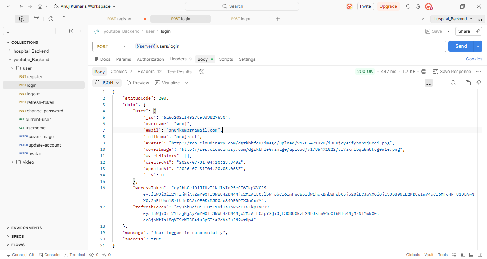
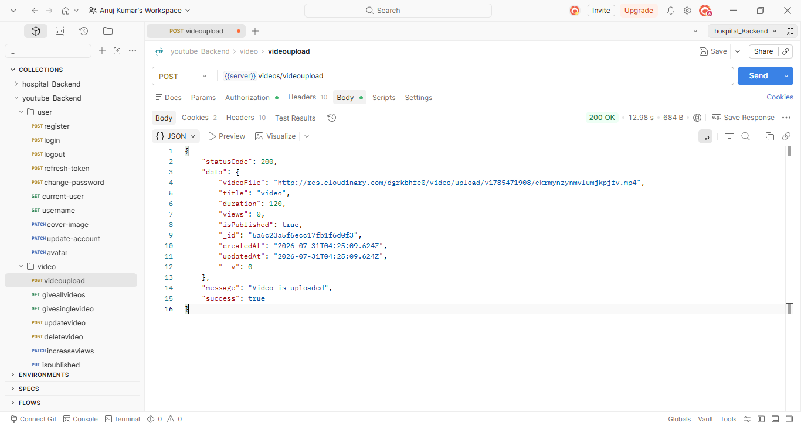
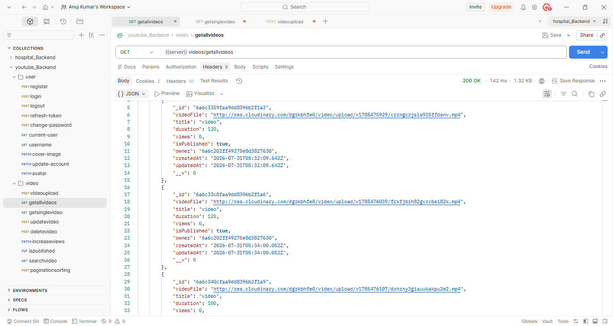
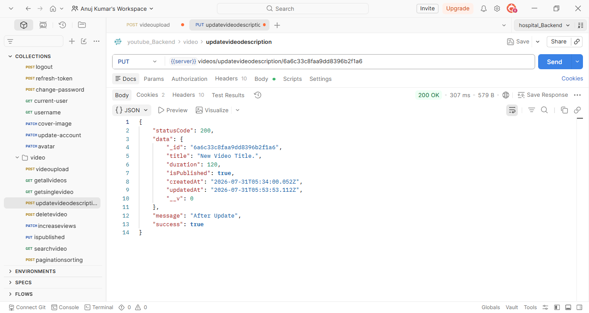
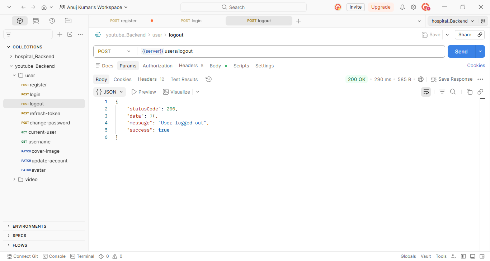

# YouTube Backend API

A scalable backend application built using Node.js, Express.js, and MongoDB to support user authentication, video management, subscription handling, and cloud-based media storage.

## API Screenshots

### User Login

Authenticates a user using JWT and returns access and refresh tokens.



---

### Video Upload

Uploads a video to Cloudinary and stores the metadata in MongoDB.



---

### Get All Videos

Fetches all videos uploaded by the authenticated user.



---

### Update Video Description

Updates the description of a specific video using its unique video ID.



---

### User Logout

Logs out the authenticated user by clearing authentication tokens.



---

### Database Verification (MongoDB Compass)
Screenshot confirming that uploaded video data is successfully persisted in MongoDB after a successful API call.
   


## Overview

This project focuses on building a backend system for a video platform using RESTful APIs. It includes user authentication, video upload and retrieval functionality, subscription management, database design, and media storage integration.

## Features

* JWT-based User Authentication
* User Management APIs
* Video Upload and Retrieval APIs
* Subscription Management APIs
* Cloudinary Media Storage Integration
* MongoDB Data Modeling
* Input Validation
* Centralized Error Handling
* RESTful API Architecture

## Tech Stack

### Backend

* Node.js
* Express.js

### Database

* MongoDB

### Media Storage

* Cloudinary

### Tools

* Postman
* Git
* GitHub

## Key Contributions

### Backend API Development

Designed and developed RESTful APIs to support user management, video uploads, content retrieval, and subscription functionality while maintaining a clean and scalable backend architecture.

### Database Design & Data Modeling

Created MongoDB schemas and data models for users, videos, subscriptions, and related metadata to ensure efficient data storage and retrieval.

### Media Storage & Processing

Integrated Cloudinary for secure cloud-based storage and optimized delivery of image and video assets.

### API Reliability & Error Handling

Implemented centralized validation and error handling mechanisms using standard HTTP status codes to ensure consistent API responses.

### Performance Optimization

Optimized backend logic and database queries to improve API response times and overall application scalability.

## Project Structure

```text
src/
├── controllers/
│   ├── user.controller.js
│   ├── video.controller.js
│   └── subscription.controller.js
├── models/
├── routes/
├── middlewares/
├── utils/
└── db/
```

## Installation

### Clone the Repository

```bash
git clone https://github.com/raut-anuj/YouTube_backend.git
```

### Navigate to Project Directory

```bash
cd YouTube_backend
```

### Install Dependencies

```bash
npm install
```

### Configure Environment Variables

Create a `.env` file and add the required configuration values.

### Start the Development Server

```bash
npm run dev
```

## API Testing

All APIs were tested using Postman to verify request validation, authentication flow, response handling, and endpoint functionality.

## Learning Outcomes

* Building RESTful APIs using Express.js
* Implementing JWT Authentication
* MongoDB Schema Design and Data Modeling
* Cloudinary Integration for Media Storage
* API Validation and Error Handling
* Backend Debugging and Testing with Postman

## Author

Anuj Raut

GitHub: https://github.com/raut-anuj
